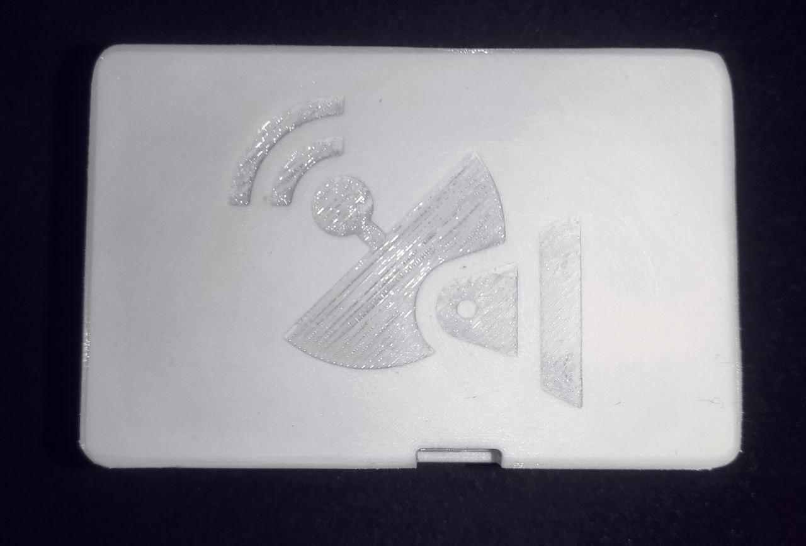

# Lua Zephyr module
This repository provides an example of how the [Lua language](https://www.lua.org/about.html) can be integrated in a project using the [Zephyr embedded operating system](https://www.zephyrproject.org/). Also, this repository is structured as a Zephyr module in order to facilitate the integration. 

# Application example
Under the folder `app/` you can see an example on how to use `Lua` in a Zephyr project, this application uses at the same time another module located inside `app/iridium/` which implements some useful libraries in order to communicate with _Iridium SBD 960X_ like transceivers and perform satellite communications using the Iridium constellation, as you could think, this type of hardware and services are far from being cheap, but I am glad to tell you that you will be able to test this service for free without the need of having the hardware physically or any additional service bills, this is possible thanks to the recently implemented [Iridium SBD emulator](https://glab.lromeraj.net/ucm/miot/tfm/iridium-sbd-emulator) which will allow you to emulate the modem itself and the Iridium GSS.

> **NOTE**: this emulator is currently under development and some functionalities are not available, which implies different limitations, but it is currently functional and you can test basic app logic while using Iridium SBD transceivers.

The Iridium module mentioned above is actually a Zephyr module which is included as a GIT submodule in this repository (see `.gitmodules`). The Iridium module already includes the emulator but only for testing purposes (which is fully automated).

Depending on your current situation or resources, you'll feel more identified with one of the following possibilities:
1. I don't have any hardware more than my basic computer.
2. I have an Iridium SBD 960X like transceiver and probably an active Iridium SBD service contract, but I don't have a physical board where I can connect it. 
3. I have all the required hardware and very probably an active Iridium SBD service contract.

If you are in the first situation, you'll be limited to the emulator capabilities, but don't worry because it will increase it's functionality gradually ...

For those who currently just have an _Iridium SBD 9602/9603_ transceiver but don't have a physical prototyping board, Qemu will become really helpful which is fully integrated within Zephyr.

# Cloning the repository

This repository depends on additional repositories which are included as _GIT_ submodules, so when cloning use the flag `--recursive` to avoid some additional steps, if you have already cloned it without this flag, use the following command:
``` bash
git submodule update --init
```

# Building
Actually, the build process for Lua files is quite simple and does not use any type of filesystem, this will change over time. By the moment Zephyr's toolchains have some limitations where the standard `libc` is not fully implemented and will require probably to modify even more Lua's source code.

The Lua files are compiled using `luac` and embedded directly to the firmware, you can take a look to the `CMakeLists.txt` inside the Lua folder `lib/lua/` which implements a tiny (very very tiny) build system for Lua. There you'll find a function named `lua_generate_inc_file_for_target` which has been implemented in order to simplify the building process. If you take a look inside the `CMakeLists.txt` inside the `app/` directory, you can see how it's used:
``` bash
lua_generate_inc_file_for_target(
  app
  ${CMAKE_CURRENT_SOURCE_DIR}/lua/main.lua
)
```

Currently there is only one Lua script file to be compiled, but this build system will be improved over time, the good point about this is that it's fully integrated with the Zephyr build system and any modification in the Lua source code will be treated as a modification in a regular `.c` or `.h` file and the final binary firmware will be reassembled. The Lua source files are located under `app/lua/` folder.

I suppose that you already have Zephyr framework installed on your computer and ready to be used, if not, you can take a look to [this wiki section](https://glab.lromeraj.net/ucm/miot/tfm/iridium-sbd-library/-/wikis/Home/Getting-started) as it shows a slightly different manner of loading Zephyr framework tools.  

To request a build, is as simple as executing the Zephyr `west` tool in the following way:

> **NOTE**: remember to execute the following commands inside the application directory `app/`.

``` bash
west build -b <BOARD>
```
If you have a physical board try to build the source for it, but I can't warranty you a success during the build process, 
it is a very premature repository, so things can go wrong easily.

In case you don't have a physical board, you'll have to set a Qemu board as target, the recommended Qemu board is `qemu_cortex_a9` which has plenty of hardware resources by default (many more than necessary). So the command should be:
``` bash
west build -b qemu_cortex_a9
```

This should build all the sources and generate the final binary firmware. You can use some extra variables in order to modify slightly the building process:
- `DEBUG=<yes/no>`: use this flag to debug the application.
- `QEMU_TTY_PATH=<path>`: sets the TTY path for Qemu, this option is useful while using virtual serial ports.

For example to build with debugging enabled, simply use:
``` bash
west build -b qemu_cortex_a9 -- -DDEBUG=yes
```

To disable debugging:
``` bash
west build -b qemu_cortex_a9 -- -DDEBUG=no
```

If you want to specify the TTY port for Qemu, use:
``` bash
west build -b qemu_cortex_a9 -- -DQEMU_TTY_PATH=/tmp/qemu
```

This will be explained in more detail in the following section.

# Running the app

The different possibilities while running the application are shown below. 

## Full software execution

If you are using a qemu emulated board, execute the following command to run the application:
``` bash
west build -t run
```

You'll probably see some errors in the output, this is because the emulated device is not being able to communicate with the Iridium SBD 960X transceiver, press `CTRL+A` and then `X` to exit.

> **NOTE**: use `CTRL+A` and then `C` to interact with the Qemu virtual machine.

In order to solve this, we have first to emulate the device itself, and for that we have to build the emulator, this process is explained in the corresponding [Iridium SBD emulator repository](https://glab.lromeraj.net/ucm/miot/tfm/iridium-sbd-emulator).

Now you should have access to the main programs of the emulator: `960x.js` and `gss.js`.

Before starting the emulator we have to create a pair of virtual serial ports in order to allow communication between the Qemu virtual machine and the Iridium SBD emulator. We can use `socat` to achieve this:
``` bash
socat -dd pty,link=/tmp/qemu,raw,echo=0 pty,link=/tmp/960x,raw,echo=0
```

Now start the Iridium SBD 960X emulator script:
``` bash
node 960x.js -p /tmp/960x -vvv
```

If the response is something like:
``` bash
2023-04-20T21:25:55.638Z [ OK ]: 	AT Interface ready
```
the emulated Iridium SBD 960X transceiver is ready to handle incoming AT commands.

Now we have to start the Qemu virtual machine but indicating the TTY port:
``` bash
west build -t run -- -DQEMU_TTY_PATH=/tmp/qemu
```

This should give an output like:
``` bash
*** Booting Zephyr OS build zephyr-v3.3.0-2906-gc4565ad5b652 ***
Example of Iridium SBD application using Lua
Iridium SBD service setup OK
```

There is one more thing left, we have to start the emulated Iridium GSS in order to allow the modem to communicate with the "satellites":

``` bash
node gss.js -vvv
```

You can specify the MO (_Mobile Originated_) transport to be used:
``` bash
node gss.js --mo-tcp-host my.domain.example.com --mo-tcp-port 10800 -vvv
```

This will emulate _MO_ Direct IP messages to the destination over TCP, see [the following repository](https://glab.lromeraj.net/ucm/miot/tfm/iridium-sbd-server) if you want to run your own server instance.

> **NOTE**: you can use SMTP transport simultaneously with TCP, but this information is not detailed here, please see the [official repository of the emulator](https://glab.lromeraj.net/ucm/miot/tfm/iridium-sbd-emulator).

If you are still running the Qemu virtual machine you will see how the output shows things like:
``` txt
Example of Iridium SBD application using Lua
Iridium SBD service setup OK
Event (002) received
Event (001) received
```

## Hybrid execution

Hybrid execution consists in having the original Iridium SBD 960X transceiver but without having a physical board to connect it. In this case you need to create virtual serial port in order to communicate with the modem:
``` bash
socat -dd pty,link=/tmp/qemu,raw,echo=0 /dev/ttyUSB0,b19200,raw,echo=0
```

> **NOTE**: by default, if you don't have any additional serial device connected, the following file `/dev/ttyUSB0` should work in most cases, but it could be different depending on your OS or configuration. Also, the flag `b19200` specifies the baud rate at which the device is operating.

Now start the app with Qemu pointing to the previously created virtual serial port:
``` bash
west build -b qemu_cortex_a9 -t run -- -DQEMU_TTY_PATH=/tmp/qemu
```
___

In case you are in the opposite situation and you want to connect you physical board with the emulator, you have to crate again a virtual serial port in order to connect your board with the emulated modem:
``` bash 
socat -dd /dev/ttyUSB0,b19200,raw,echo=0 pty,link=/tmp/960x,raw,echo=0
```

## ~~Full hardware execution (TODO)~~

# Test prototype
This app and additional libraries have been tested using a custom prototype showed below:

<div align="center">

  

  
  
  

</div>


